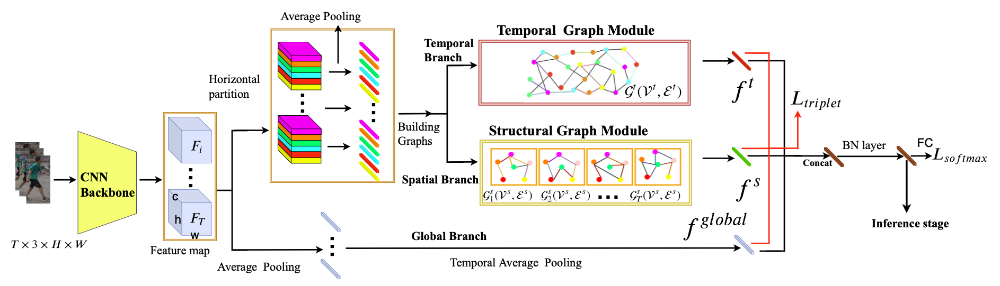
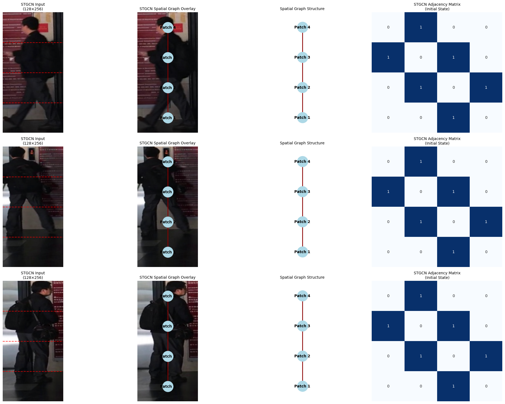
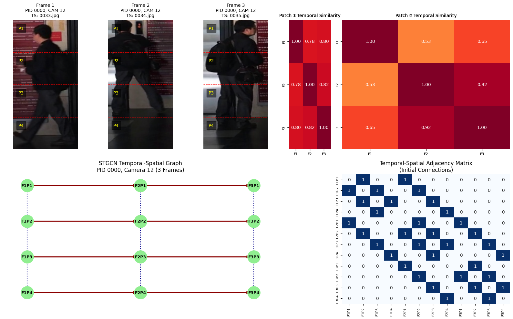
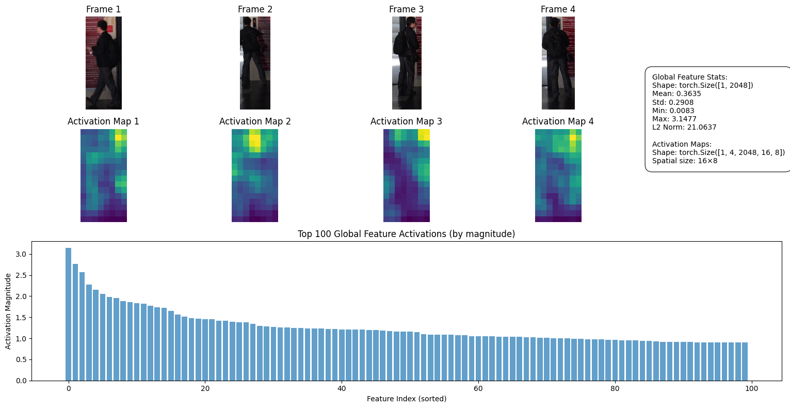
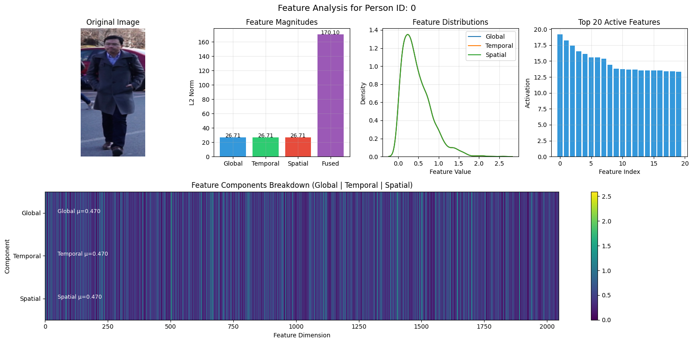
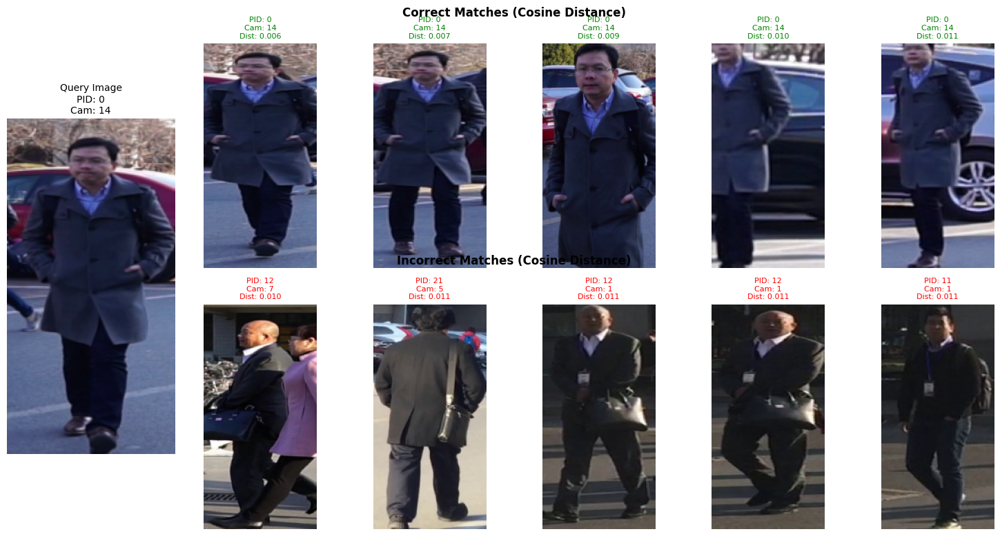

# Person Re-Identification with Spatial-Temporal Graph Convolutional Networks (STGCN)

This repository implements a deep learning approach for Person Re-Identification (Re-ID) using Spatial-Temporal Graph Convolutional Networks. The model leverages both spatial and temporal relationships between body parts across video frames to improve Re-ID accuracy.

## 📊 Project Overview

Person Re-Identification is the task of matching images of the same person across different cameras and viewpoints. This implementation:

- Uses a Graph Convolutional Network (GCN) architecture to model spatial and temporal relationships
- Processes video sequences to extract temporal patterns in addition to spatial features
- Implements state-of-the-art approaches for improved accuracy in challenging scenarios
- Demonstrates results on the MSMT17 dataset, a large-scale person Re-ID benchmark


*MSMT17 dataset samples and distribution*

## 🗂️ Repository Structure

```
reidgpt/
├── dataset/                  # Dataset directory
│   └── MSMT17/               # MSMT17 dataset
│       ├── bounding_box_train/ # Training images
│       ├── bounding_box_test/  # Testing gallery images
│       └── query/              # Query images for evaluation
├── models/                   # Saved model weights
│   └── model1400.pth         # Pre-trained model checkpoint
├── output/                   # Output visualizations
│   ├── dataset_visualization.png  # Dataset exploration and statistics
│   ├── spatial_graph.png          # Spatial graph connections
│   ├── temporal_graph.png         # Temporal graph analysis
│   ├── STGCN Graph Modules.png    # Model architecture visualization
│   ├── feature_analysis.png       # Feature map analysis
│   ├── global_branch.png          # Global feature branch visualization
│   ├── matches.png                # Re-ID matching results
│   └── t-SNE feature.png          # Feature space visualization
├── person RE-Id STGCN.ipynb  # Main Jupyter notebook with implementation and visualizations
└── train.py                  # Training script for the STGCN model
```

## 🔧 Installation Requirements

To run the code in this repository, you need to install the following dependencies:

```bash
# Base scientific packages
pip install numpy matplotlib pillow tqdm seaborn networkx opencv-python

# PyTorch and related packages
pip install torch torchvision

# PyTorch Geometric for GCN implementation
pip install torch-geometric

# Machine learning and evaluation
pip install scikit-learn 
```

### Hardware Requirements

- GPU with CUDA support (recommended: 11GB+ VRAM)
- Multi-GPU setup is supported and recommended for faster training

## 📝 Dataset

This implementation uses the MSMT17 dataset, which needs to be downloaded separately and organized as follows:

- `dataset/MSMT17/bounding_box_train/` - Training images
- `dataset/MSMT17/bounding_box_test/` - Testing gallery images
- `dataset/MSMT17/query/` - Query images for evaluation

The dataset follows the format `PersonID_CameraID_FrameNumber.jpg`.

## 🧠 Model Architecture

The STGCN model consists of several key components:

1. **Backbone Network**: Modified ResNet50 with adjusted strides to maintain spatial resolution
2. **Spatial Graph Module**: Models relationships between body parts within a frame
3. **Temporal Graph Module**: Models relationships across frames for the same body part
4. **Feature Fusion**: Combines spatial and temporal features for robust representation


*STGCN model architecture showing spatial and temporal graph modules*


*Visualization of spatial relationships between body parts*


*Visualization of temporal relationships across frames*


*Global feature extraction and processing pipeline*

## ⚙️ Training

To train the model, run:

```bash
python train.py
```

The training script supports:
- Multi-GPU training
- Mix-precision training
- Triplet loss with hard-mining
- Cosine annealing learning rate schedule

## 📊 Results & Visualization

The notebook includes comprehensive visualizations:

1. Dataset exploration and statistics
2. Feature map visualization
3. Spatial graph connections
4. Temporal graph analysis
5. Evaluation metrics on MSMT17


*Detailed feature map analysis and learned representations*


*Sample person re-identification matching results*


*t-SNE visualization of learned feature embeddings*
